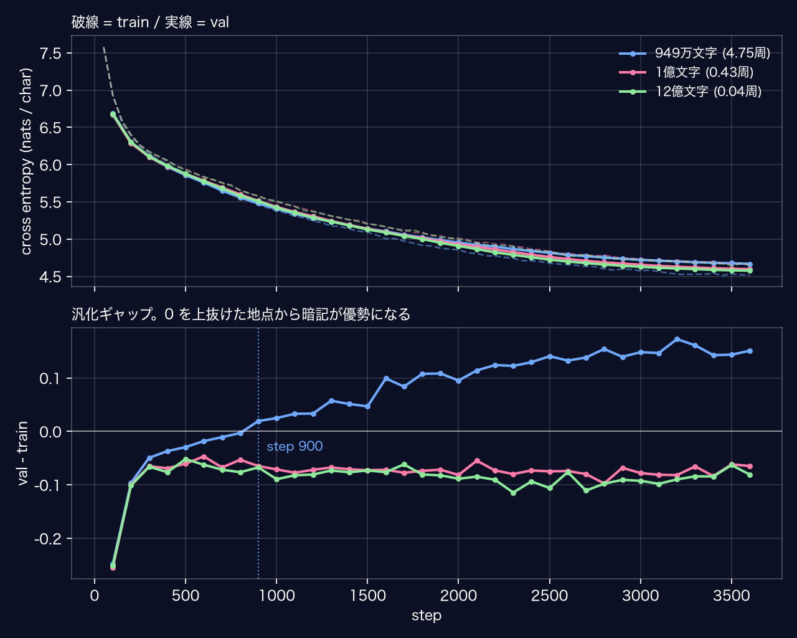
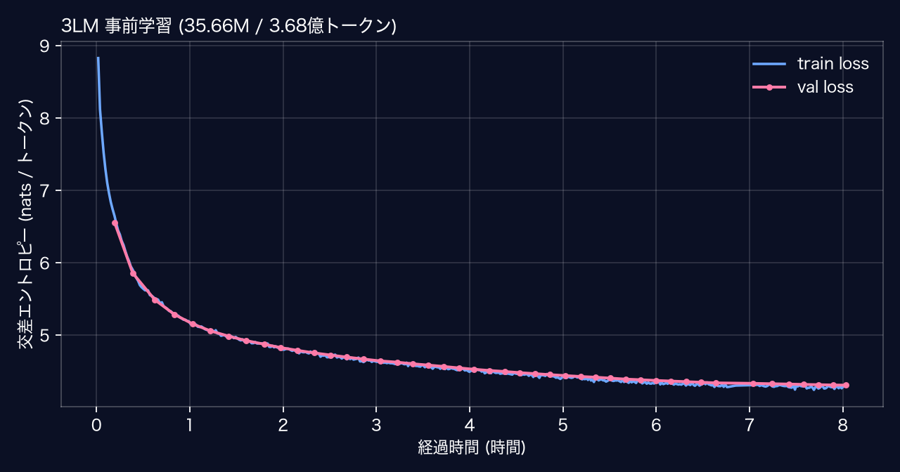
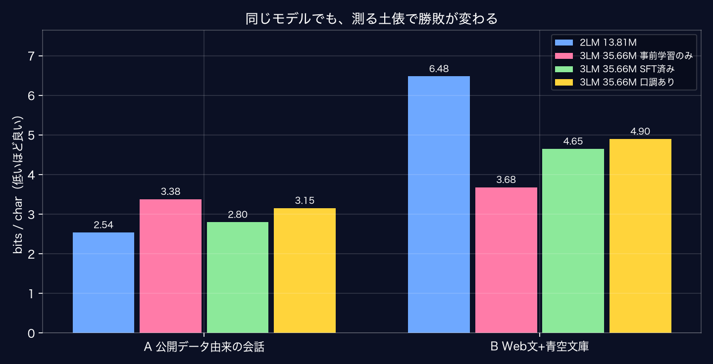

# 3LM-MLX &mdash; MacBook 1台で、一晩かけて言語モデルを学習させる

M1 Max 1台で、**35.66M パラメータの日本語モデルを一晩（約8時間）事前学習**した
記録とコード一式です。

前作（2LM）は 13.81M パラメータを 949万文字・27分で学習させ、
**「データが必要量の1.7%しかない」**という診断で終わっていました。
このリポジトリはその**答え合わせ**から始まります。

- モデル: 6層 / 512次元 / 8ヘッド / 文脈512 / **35.66M パラメータ**（非埋め込み 19.27M）
- 構成: **RoPE / RMSNorm / SwiGLU / bias なし / weight tying**
- コーパス: FineWeb2 日本語（ODC-By 1.0）+ 青空文庫（CC BY 4.0）**12億文字**
- 語彙: SentencePiece unigram **32,000**（byte fallback）
- 学習: **約8時間 / 3.68億トークン / D/N 19.1**（Chinchilla の目安 20）
- 環境: MacBook Pro 14インチ / M1 Max（32コアGPU）/ ユニファイドメモリ 64GB

## シリーズの位置づけ

| リポジトリ | 内容 | 状態 |
|---|---|---|
| [1LM](https://github.com/hiroki-abe-58/1LM) | 1時間で動くものを作る。Transformer を自分で書く | 凍結 |
| [2LM-MLX](https://github.com/hiroki-abe-58/2LM-MLX) | 会話が成立するレベルへ。評価設計・データ増量・サブワード化 | 凍結 |
| [2LM-MLX-GAL](https://github.com/hiroki-abe-58/2LM-MLX-GAL) | 学習データを自分で作ってキャラクターを持たせる | 凍結 |
| **3LM-MLX**（ここ）| **一晩の学習を落とさずに完走させる。データ不足の答え合わせ** | |

**このリポジトリは単体で完結しています。** 他をクローンする必要はありません。

## このリポジトリの主題

前作までは「27分で学習が終わる」規模でした。8時間だと問題が変わります。

**7時間目に落ちたら、その日は終わりです。**

なので主題は「モデルを良くすること」ではなく、
**長時間の学習を落とさずに完走させること**と、**測り方を検証すること**です。

## すぐ試す

```bash
CONDA_SUBDIR=osx-arm64 conda create -n 3lm python=3.11 -y
conda activate 3lm
conda config --env --set subdir osx-arm64
pip install -r requirements.txt

# 重みを取る (136MB)
python -c "from huggingface_hub import snapshot_download; \
  snapshot_download('GeneLab/3LM-MLX', local_dir='checkpoints/sft-final')"

python src/chat_cli.py --ckpt checkpoints/sft-final     # CLI
python server.py --ckpt checkpoints/sft-final --open    # Chrome で GUI
```

| 置き場 | 中身 |
|---|---|
| [GeneLab/3LM-MLX](https://huggingface.co/GeneLab/3LM-MLX) | 対話調整済み |
| [GeneLab/3LM-MLX-GAL](https://huggingface.co/GeneLab/3LM-MLX-GAL) | 口調を差し替えた版 |

**重みはこのリポジトリに入れていません。** 35.66M パラメータの
`model.safetensors` は **136MB** で、GitHub の1ファイル100MB制限を超えます
（前作は 13.81M = 53MB だったので同梱できていました）。
LFS を挟むより、重み専用の置き場に置くほうが素直だと判断しました。
**モデルが大きくなると配布の方法も変わる**、というだけの話です。

---

## 1. 答え合わせ: データを10倍にすると乖離点が消えた

前作の診断を確かめました。**モデルは 13.81M のまま、データ量だけ**変えて
3,600ステップ固定で3本。語彙・検証セット・ドメインの混ざり方は共通です。



| 訓練文字数 | 訓練トークン | 周回数 | **乖離点** | 最良 val |
|---|---|---|---|---|
| 949万 | 9.84M | 4.75周 | **step 900** | 4.6673 |
| 1億 | 109.3M | 0.43周 | **なし** | 4.5964 |
| 12億 | 1,196M | 0.04周 | **なし** | 4.5767 |

乖離点は「検証損失が訓練損失を上回る点」= 暗記に入った合図です。
**データを10倍にしただけで消えました。** 診断は正しかったことになります。

同時に**飽和**も見えました。

| 変化 | 最良 val の改善 |
|---|---|
| 949万 → 1億（11.6倍）| −0.071 |
| 1億 → 12億（11倍）| **−0.020** |

同じ11倍でも2回目の効きは3分の1以下。3,600ステップで読むトークン数は
固定なので、1億文字の時点で既に **0.43周**しか回っていません。
そこから先はデータを足しても「読まないデータ」が増えるだけです。

**データ不足の解消には上限があり、その先は計算量を増やさないと進みません。**
これが8時間を投じる根拠になりました。

> 注: 前作の乖離点（step 1,750）は再現していません。コーパスの中身が違う
> （対話 → ウェブ+青空文庫）ためで、ここで見ているのは絶対値ではなく**動く向き**です。

## 2. 落ちても続く学習ループ

保存しているのは重みだけでは足りません。

| 保存するもの | 欠けるとどうなるか |
|---|---|
| モデルの重み | 論外 |
| **オプティマイザ状態**（Adam の m, v）| 再開直後に損失が跳ねる |
| **ステップ数** | 学習率スケジュールが最初から始まる |
| **データの読み位置** | 同じ場所を2回読む / 読まない範囲ができる |

```
checkpoints/pretrain/
├── CURRENT              # "ckpt-A" か "ckpt-B" を os.replace で原子的に書く
├── ckpt-A/
│   ├── model.safetensors
│   ├── optimizer.safetensors   # step / m / v
│   ├── train_state.json        # step, tokens_seen, best_val, seed, args
│   └── COMPLETE                # 全部書けてから最後に置く完了マーカー
└── ckpt-B/                     # A と交互に書く
```

- 書くのは常に「今使っていない側」。**書き込み中に落ちても、もう一方は無傷**
- `shutil.rmtree` → `rename` の順で書くと**その隙間で落ちると消える**（前作がこれ）
- ログは追記のみ。再開時に `# resumed at step N` を残す

### データ位置は保存しない

バッチの中身を **`(seed, step)` だけの関数**にしました。

```python
rng = np.random.default_rng([seed, step])
```

step が分かればデータ位置も決まるので、**保存するものが1つ減ります。**
検証も「別プロセスで同じ `(seed, step)` を渡して配列を比較」で済みます。

`step` を復元すれば**学習率も自動的に戻ります**（MLX のスケジューラは
optimizer の step を見る）。

## 3. わざと kill して検証する

```bash
python3 tools/killtest.py
```

`kill -9` を2回はさんで再開し、通しで走らせた場合と比べます。
**`SIGTERM` ではなく `SIGKILL`** を使うのが要点です。
SIGTERM だと「保存して終了」の道を通ってしまい、本当に落ちたときの経路を試せません。

### ビット一致は条件にできない

MLX / Metal の GPU はリダクションの順序が実行ごとに変わります。
浮動小数点の加算は結合則が成り立たないので、最下位ビットがずれます。
1回は 1e-7 でも、**オプティマイザが増幅して 97ステップで 5e-3 まで育ちます。**

**中断せずに同じ設定で2回走らせても一致しません。** なので
「雑音の床」を毎回測ってから比べます。

| 見るもの | 判定 | なぜ |
|---|---|---|
| バッチの中身 | **完全一致** | CPU の numpy 計算 |
| 復元直後の状態 | **完全一致**（重み / m / v / step / lr）| ファイルの往復だけ |
| 再開後の最終重み | 床の3倍以内 | GPU 計算が入る |
| 損失曲線の段差 | 0.05 以内 | m, v の破損を検出 |
| **対照実験**（m,v を消す）| 床の**5倍以上離れる** | これが無いと閾値に意味が無い |

実測（`runs/3lm/killtest.json`）:

```
[雑音] 同設定を2回走らせた差   : 4.103e-03   ← 下限
[C]  kill -9 を2回はさんだ差   : 6.079e-03   (雑音の 1.48倍)  合格
[対照] m,v を捨てた場合の差    : 1.141e-01   (雑音の 27.8倍)  検査は機能している
[D]  kill 後の曲線の段差       : 0.0001      (許容 0.05)
[対照] m,v を捨てた場合の段差  : 0.1177
```

### この検査は一度、嘘をついた

最初 `[D]` に **0.4597** が出ました。**壊した対照（0.1177）より大きい**という
ありえない結果です。原因は再開ではなく、`train_loss` が
**直近10ステップの平均**だったこと。

```
10,...,8.4241            ← 1〜10 の平均
# resumed at step 7
10,...,7.9644            ← 8〜10 の平均。後半だけなので必ず低い
```

平均する範囲が違うものを引き算していました。窓が切られた行を除外して 0.0001。

**検査が落ちたとき、最初に疑うべきは検査のほうです。**
気づけたのは対照実験があったからで、**対照は閾値に意味を与えるだけでなく、
検査自体の故障を検出します。**

## 4. 較正してからモデルサイズを決める

```bash
python3 tools/calibrate.py
```

8層42Mで計画していましたが、**測ったら入りませんでした。**

| 構成 | パラメータ | 実測 tok/s | 8時間で読める | D/N |
|---|---|---|---|---|
| 6層 384次元 batch24 | 23.12M | 19.8k | 5.14億 | 48.4 |
| **6層 512次元 batch32** | **35.66M** | **14.2k** | **3.68億** | **19.1** |
| 6層 512次元 batch48 | 35.66M | 13.0k | 3.36億 | 17.4 |
| 7層 512次元 batch32 | 38.87M | 12.2k | 3.16億 | 14.1 |
| **8層 512次元 batch24（計画）** | **42.08M** | **10.9k** | **2.83億** | **11.0** |
| 10層 640次元 batch16 | 68.83M | 7.1k | 1.84億 | 3.8 |

**見込み 31k tok/s に対して実測 10.9k**（3分の1）。ctx を 256 → 512 にすると
行列積は大きくなりますが、**アテンションは文脈長の2乗で増えます。**

8層は D/N 11.0 で**前作と同じ「データ不足」の失敗**になります。
6層なら 19.1 で目安どおり。**8時間の前の5分は安い。**

バッチサイズには最適点があります（24: 13.4k → 32: 14.2k → **48: 13.0k**）。
48 ではメモリも 16.8GB に増えて遅くなる。**測らないと分かりません。**

本番は 11.9k tok/s（較正より16%減）でした。検証・保存・
**1.1GB の memmap のランダム読み**が乗るためで、
`--max-hours` を保険に置いて時間切れでも正常終了させています。

## 5. 数GBのコーパスを扱う

```bash
python3 data/prepare_pretrain.py --target-chars 1300000000
python3 data/encode.py --corpus data/corpus_pretrain.txt --out data/3lm --vocab-size 32000
```

- 全文を `list[int]` で持つと**5億トークンで18GB**。`np.memmap` の uint16 に直書き
- HF データセットは `streaming=True` で1シャードずつ取り、**都度キャッシュから消す**
  （symlink を消しても blob が残るので、両方消す）
- `pq.read_table` は Parquet を丸ごと載せる。`iter_batches` を使う
- **revision をピン留めし、シャードの SHA256 を manifest に記録**

### SentencePiece は長い行を黙って捨てる

`max_sentence_length` の既定は **4192 バイト**。コーパスの1文書は平均4,500バイト
（UTF-8）なので、**既定のままだと半分以上が切られます。警告は出ません。**

対処は `max_sentence_length` を上げることと、
**語彙学習用のサンプルを文書ではなく文に割ること**（`data/encode.py`）。

### 1トークンあたり文字数は実測する

| | 語彙 | 1トークンあたり |
|---|---|---|
| 前作（対話データ）| 8,000 | 2.362文字 |
| **今回（ウェブ文書）** | **32,000** | **2.101文字** |

**語彙を4倍にしたのに減りました**（見込み 2.8〜3.0 は外れ）。
ウェブ文書は語彙が広く、固有名詞や記号が混ざるためです。
**予算はトークン数で決めて、文字数は実測してから決めるべきでした。**

## 6. 検証セットの汚染を検査する

```bash
python3 tools/check_leak.py --corpus data/corpus_pretrain.txt --corpus data/corpus_sft.txt
```

固定検証セット（249行）を**行の完全一致**で除外していましたが、
部分一致で調べたら **29行が残っていました**（近似重複）。

`grep -F -f` は 3.4GB × 654パターンで**17分経っても終わりません**。
Rabin-Karp 風のローリングハッシュを書いて **81秒（39 MiB/秒）**にしました。
**遅い検査は「回さない検査」になるので、速度は正しさの一部です。**

除外を40文字断片の一致に変えて混入0件に。
学習データ（事前学習3.4GB / SFT / ギャル）すべてで混入なしを確認しています。

### 混入を除いたら点が「良く」なった

| 検証セット | 行数 | 前作の bits/char |
|---|---|---|
| 混入込み | 249 | 2.584 |
| **混入29行を除く** | 220 | **2.540** |

予想と逆でした。混入していた29行は「覚えていた行」ではなく
**たまたま平均より難しい行**で、差は混入の効果ではなく**集合の中身が変わった効果**です。
比較には**どちらのモデルも見ていない 2.540** を使います。

## 7. 一晩走らせる

```bash
bash scripts/train_overnight.sh
python3 tools/watch.py            # 別端末から進捗を見る
```

- `caffeinate -dimsu` でスリープを抑止、`nohup` で端末から切り離す
- **落ちたら自動で再投入。ただし step が進んでいなければ中止**（無限ループ防止）
- `mx.set_memory_limit` / `set_cache_limit` + preflight（**MLX は既定で上限を持たない**）
- heartbeat に step / loss / tok/s / ETA / **熱で絞られていないか**を書く

### 結果: 仕掛けは一つも発動しなかった

```
step 22,437 / 22,437  |  3億6,760万トークン  |  8.03時間  |  再開 0 回
val_loss 6.554 → 4.306（最後まで単調減少）  |  ピークメモリ 13.3GB / 上限 36GB
```



tok/s は 11.9k → 14.3k と**上がりました**。熱ではなく、
序盤に**同じ GPU で評価や kill テストを走らせていた**のが原因です。
**長時間走行中に別の GPU 作業をすると、そのログは速度の記録として使えません。**

train と val はほぼ重なったまま。コーパスを **0.65周**しか読んでいないので、
暗記する機会がありません。なお自作の「乖離点」指標は step 2,500 と出ますが、
**これは読んではいけない数字**です。乖離点が意味を持つのは dropout で
train 側に下駄がある場合だけで、今回は dropout 0 なので両者は同じ量を測っています。

## 8. 対話に合わせる（SFT）

```bash
python3 src/sft.py --init-from checkpoints/pretrain-final --corpus data/corpus_sft.txt
```

損失は **`<|assistant|>` より後ろと `<|end|>` だけ**に掛けます（instruction masking）。
前作はこれをやっていません。

**マスクは間違っていても学習が動きます**（損失は下がる）。失敗は2通り。

- **1トークンずれ**: 「質問の続きを書く」癖が残る
- **終了記号を数えていない**: 返答が終わらず、次の質問を自分で書き始める

どちらも生成するまで気づかないので、位置を突き合わせる検査を置きました。

```bash
python3 tools/check_mask.py       # マスクの位置あわせ
python3 tools/check_kvcache.py    # KVキャッシュが一括計算と一致するか
```

KVキャッシュも**間違っていても動く**類です（RoPE の offset 忘れ、マスクの形、
学習した位置埋め込みの添字）。「1トークンずつ」と「まるごと」の logits を突き合わせます。

### 結果: 前作に負けた。そして負けた理由は土俵だった

前作と同じ検証セット・同じサンプリング条件（temperature 0.8 / top_k 40 /
rep 1.15 / seed 777）で採点しました。

| 指標 | 2LM 13.81M | 3LM 35.66M |
|---|---|---|
| bits/char | **2.540** | 2.801 |
| 主題保持率 | **0.733** | 0.667 |
| 反復率 | **0.100** | 0.300 |
| 破綻率 | 0.000 | 0.000 |

パラメータ 2.6倍、事前学習データ 126倍で全敗です。

原因は検証セットの出自でした。`holdout_clean.txt` は**公開データ由来の会話**で、
前作は**その公開データで事前学習した**モデルです。つまりここは前作の
ホームグラウンドでした。土俵を2つにして測り直します。

```bash
python3 tools/compare_domains.py --baseline ../2LM-MLX-GAL/checkpoints/final
```



| モデル | A 公開データの会話 | B Web文+青空文庫 |
|---|---|---|
| 2LM 13.81M | **2.540** | 6.481 |
| 3LM 事前学習のみ | 3.381 | **3.680** |
| 3LM SFT済み | 2.801 | 4.651 |

**一般的な日本語では 6.481 対 3.680。** 前作は賢かったのではなく
**狭い領域の専門家**で、その領域だけで採点していたので良く見えていました。

この表は SFT の代償も示しています。土俵A は 3.381 → 2.801 と改善する一方、
土俵B は 3.680 → 4.651 と悪化します。**SFT は無料の性能向上ではなく、
どの分布に寄せるかの選択です。**

**指標は「何で測ったか」とセットでなければ意味を持ちません。**

## 8-2. 口調を乗せる（3LM-MLX-GAL）

```bash
python3 src/sft.py --init-from checkpoints/sft-final --corpus data/corpus_gal.txt \
    --out checkpoints/gal --epochs 8 --lr 1e-4
```

前作で作ったギャル会話 **2,610件**をそのまま当てます。狙いは
「モデルが大きくなると必要なキャラクターデータも増えるのか」を測ることでした。

**増えませんでした。** 30ステップ（約48秒）で口調が乗り、
しかも**失うものが減っていました。**

| 代償（素 → 口調あり） | 2LM 13.81M | 3LM 35.66M |
|---|---|---|
| bits/char の悪化 | +0.970 | **+0.353** |
| 主題保持率の低下 | -0.466 | **-0.267** |

ギャル化後の絶対値でも 3.154 対 3.510 で今回が上回ります。
**前作のホームグラウンドですら、ギャル化した状態なら勝っています。**

素の状態では「文体を変える」ことが**持っている知識を捨てること**と
ほぼ同義だったのだと思います。事前学習が厚いと、口調は表層の付け替えで済みます。

なお当初狙っていた「必要な会話数の境界」は**測れていません**。
2,610件で足りてしまったので、下限は分からないままです。

## 9. 公開前の検査

```bash
python3 tools/secret_scan.py --git
python3 tools/check_pii.py --ckpt checkpoints/sft-final
python3 tools/upload_hf.py --ckpt checkpoints/sft-final --repo GeneLab/3LM-MLX --dry-run
```

- **許可リスト方式**（`allow_patterns` だけ使う）。除外リストは
  「書き忘れたものが上がる」ので、事故の向きが逆になります
- 鍵・トークンのパターン、`.env` の不在、**ログに残る絶対パス**、git 履歴

### コーパスに実在のメールアドレスが583種入っていた

```
コーパス 3.16 GiB
  メール形式 : 14,256 件 / 異なるもの 692
    うち例示用 (example.com 等) : 13,603 件
    うちそれ以外                : 653 件 / 異なるもの 583
  電話番号の形 : 47,551 件
```

Common Crawl 由来なら当然入ります。問題は**引き出せるか**なので、
prefix attack で測ります（`tools/check_pii.py`）。
**反復ペナルティは切ります**（付けたままだと攻撃側が不利になり、
「出なかった」が信用できない）。

結果は **60件試して完全再現 0件**（前半だけ一致が3件）。
学習は 5億6,928万トークンのうち 3億6,760万ぶん（0.65周）しか読んでおらず、
最頻のアドレスでも 3.16GiB 中6回しか出てきません。
ただし**「この攻撃では出なかった」以上のことは言えない**ので、
モデルカードにも但し書きごと書いています。

**正しい対処はコーパス構築時にマスクすることで、あとから測るのは次善です。**
品質フィルタ（日本語比率・文書長・重複除去）を書いた時点で、
個人情報の観点が抜けていました。

## ファイル

| 場所 | 中身 |
|---|---|
| `src/model.py` | MiniGPT。RoPE / RMSNorm / SwiGLU、KVキャッシュ。前作構成（`--arch 2lm`）も維持 |
| `src/train.py` | 事前学習。トークン予算駆動 / 再開 / heartbeat |
| `src/checkpoint.py` | A/B 交互書き込み、`COMPLETE`、`TrainState` |
| `src/data.py` | memmap の読み出しと `(seed, step)` の決定的バッチ |
| `src/sft.py` | 対話調整（instruction masking） |
| `src/tokenizer.py` | SentencePiece。大規模コーパスのファイル入力学習 |
| `src/generate.py` | 生成（KVキャッシュ利用） |
| `data/prepare_pretrain.py` | FineWeb2 + 青空文庫。revision ピン留めと manifest |
| `data/encode.py` | memmap への符号化、語彙学習用サンプルの文分割 |
| `data/prepare_sft.py` | 対話データの整形と**断片一致での検証セット除外** |
| `eval/run.py` | 4指標（bits/char・反復率・主題保持率・破綻率） |
| `tools/killtest.py` | **kill -9 して再開を検証**（負の対照つき） |
| `tools/calibrate.py` | tok/s の較正 |
| `tools/check_leak.py` / `substring_scan.py` | 検証セット汚染の検査（ローリングハッシュ） |
| `tools/check_mask.py` / `check_kvcache.py` | マスクと KVキャッシュの検査 |
| `tools/check_pii.py` / `secret_scan.py` | 個人情報と機密の検査 |
| `tools/make_model_card.py` | モデルカードを成果物から自動生成 |
| `scripts/train_overnight.sh` | 一晩の学習（caffeinate / 自動再投入） |

## ライセンス / クレジット

- コード: **MIT**（`LICENSE`）
- 重み: **Apache-2.0 相当**
- 学習データの帰属（`NOTICE` に記載）:
  - [HuggingFaceFW/fineweb-2](https://huggingface.co/datasets/HuggingFaceFW/fineweb-2)
    `jpn_Jpan` &mdash; **ODC-By 1.0**
  - [globis-university/aozorabunko-clean](https://huggingface.co/datasets/globis-university/aozorabunko-clean)
    &mdash; **CC BY 4.0**
  - SFT: [kunishou/oasst1-89k-ja](https://huggingface.co/datasets/kunishou/oasst1-89k-ja) /
    [llm-jp/oasst2-33k-ja](https://huggingface.co/datasets/llm-jp/oasst2-33k-ja) /
    [llm-jp/magpie-sft-v1.0](https://huggingface.co/datasets/llm-jp/magpie-sft-v1.0) /
    [Aratako/Magpie-Tanuki-8B-97k](https://huggingface.co/datasets/Aratako/Magpie-Tanuki-8B-97k)
    &mdash; すべて **Apache-2.0**

**継承条件（ShareAlike）のあるデータは意図的に使っていません。**
重みを Apache-2.0 相当で配布するためです。

コーパス本体は再ホストせず、**revision のピン留めと SHA256 を記録した
manifest + 構築スクリプト**で再現できる形にしています。
